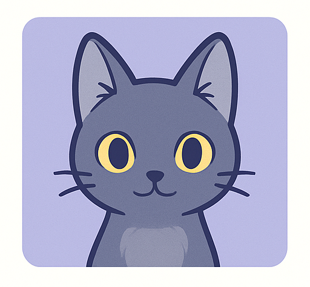
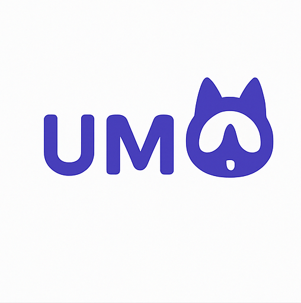
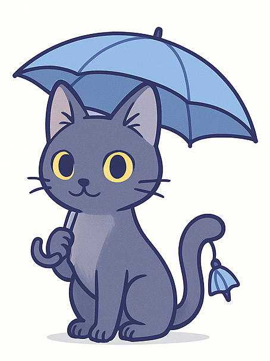
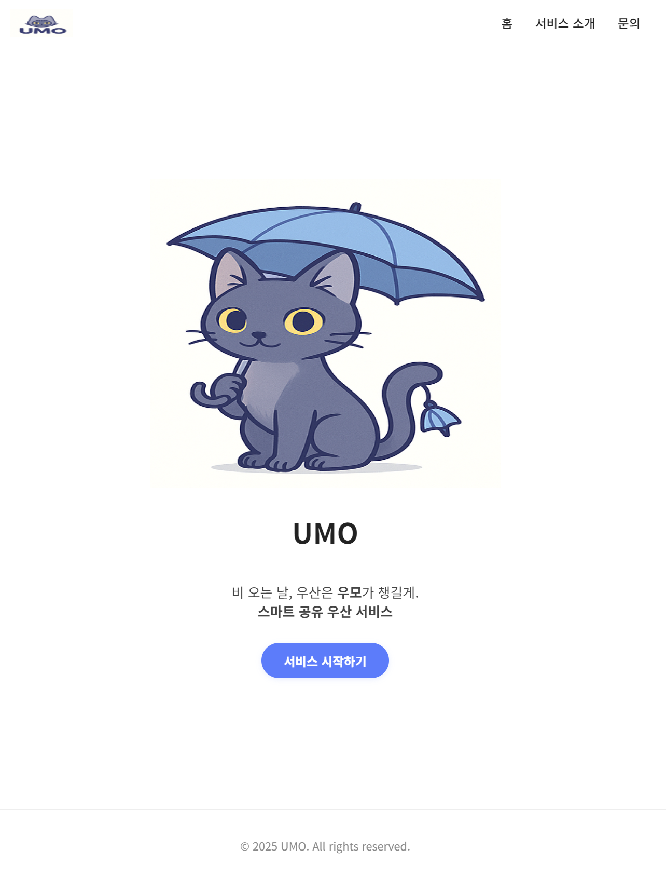

# ☂️ UMO - Urban Umbrella Mobility

<<<<<<< HEAD

=======

>>>>>>> 50eef523736b62741b264a85960f62651b1ea3a6

> **비 오는 날, 우산은 우모가 챙길게.**

UMO는 도시 속 사용자들이 비를 걱정하지 않고 자유롭게 이동할 수 있도록 도와주는 **스마트 공유 우산 서비스**입니다. 고양이 마스코트 **우모(Umo)** 가 언제 어디서든 우산을 안내하고, 공유할 수 있도록 도와줍니다.

---

## 🐱 소개

UMO는 우산을 필요한 순간에 대여하고, 자유롭게 반납할 수 있는 **도시형 공유 우산 플랫폼**입니다.  
마스코트인 **우모(Umo)** 는 사용자에게 귀엽고 신뢰감 있는 가이드 역할을 하며, 비 오는 날 당신의 곁을 지켜줍니다.

### 핵심 기능
- 🔍 실시간 우산 위치 확인
- 📍 대여소 기반 우산 예약 / 반납
- 🌧️ 날씨 기반 스마트 알림
- 🧾 이용 내역 & 포인트 시스템

---

## 📱 데모

> (스크린샷 or 영상 링크 첨부 예정)

---

## 🧱 기술 스택

**프론트엔드**
- Next.js (React 기반)
- Tailwind CSS
- Axios 통신
- Progressive Web App (PWA) 지원

**기타**
- GCP, Vercel, Docker
- S3 (우산 위치 데이터 이미지)

---
